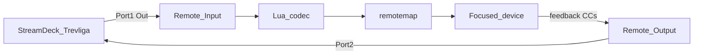
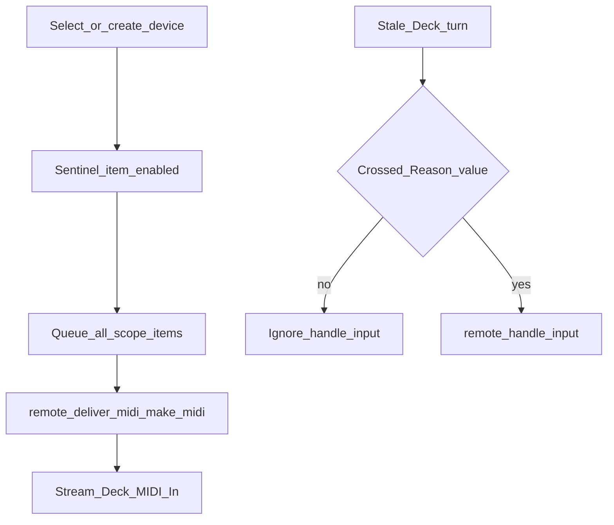

# Reason Remote

## Mandatory first step

Before creating or installing any Remote codec/map:

1. Re-read this skill and [reference.md](reference.md).
2. Prefer [`reason-streamdeck-remote/install-remote.ps1`](../../../reason-streamdeck-remote/install-remote.ps1).
3. Fully quit and restart **Reason or Reason Recon** after codec/map changes.
4. For the Stream Deck companion profile half, also read [streamdeck-profiles](../streamdeck-profiles/SKILL.md).

## Two different MIDI stacks (do not mix)

| Path | Ports | Feedback | This repo |
| --- | --- | --- | --- |
| **Remote** (Preferences → MIDI → control surfaces) | In Port 1 / Out Port 2 | Yes (change-driven + our dump) | `reason-streamdeck-remote/` |
| **External Control Bus** (Sync prefs → Bus A) | `loopMIDI Port` only | No | Reason-Fury profile |

Device CC charts on External Bus are **one-way** and use **different CC numbers** than the Remote Lua codec. Never reuse Bus chart CCs inside the codec without a dedicated map.

## Prefer existing scripts

| Side | Script |
| --- | --- |
| Reason codec + map | `reason-streamdeck-remote/install-remote.ps1` |
| Stream Deck demo | `build-remote-profile.ps1` + `install-streamdeck-profile.ps1` |
| Stream Deck Fury Remote | `build-fury-remote-profile.ps1` + `install-streamdeck-profile.ps1 -ProfileName 'Reason - Fury Remote' -SourceRelative 'StreamDeck\Reason-Fury-Remote.sdProfile'` |

`build-*-profile.ps1` alone does **not** register a manufacturer in Reason.

## Hard invariants

| Rule | Correct | Failure |
| --- | --- | --- |
| Two installs | A: `install-remote.ps1`; B: Stream Deck profile scripts | Manufacturer missing or Deck profile missing |
| Map filename | `{Manufacturer} {Model}.remotemap` e.g. `Community Stream Deck+ Remote.remotemap` | "Remote Mapping file cannot be found"; ports/OK disabled |
| Remotemap delimiters | **Tabs** everywhere (`Scope\tPropellerheads\tCombinator`) | Control surface error / map ignored |
| Install roots | Both `%PROGRAMDATA%\Propellerhead Software\Remote` and `%APPDATA%\Propellerhead Software\Remote` | Codec or map not found after restart |
| Optional Recon DefaultMaps | Keep in sync if a copy exists under Recon `Remote\DefaultMaps\<Manufacturer>\` | Stale Scope / missing maps in Logging builds |
| Codec set | `.luacodec` + `.lua` + `.png` (about 96×96); manufacturer/model match map | Surface missing or broken |
| Dual ports | Remote In = `loopMIDI Port 1`, Out = `loopMIDI Port 2` | Feedback loop if same port both ways |
| Easy MIDI | Uncheck Port 1 and Port 2 when Remote owns them | Double-handling |
| Restart | Fully quit Reason **or Recon** after install | Stale map; ports greyed until reload |
| Knob feedback scale | auto_output `x="value"` when item `min=0,max=127` | Recon ASSERT in `MIDIUtils.cpp` |
| Pitch Bend formulas | `bit.band` / `bit.rshift` (Mackie style) | "Control surface inactivated" |
| Manual feedback MIDI | Nil-guard `remote.get_item_value` before `math.floor` / `make_midi` | "Control surface inactivated" on startup |

This project’s surface:

- **Manufacturer:** `Community`
- **Model:** `Stream Deck+ Remote`
- **Map file:** `Community Stream Deck+ Remote.remotemap`
- **Reference codec:** [`StreamDeckPlusRemote.lua`](../../../reason-streamdeck-remote/Codecs/Lua%20Codecs/Community/StreamDeckPlusRemote.lua)

## Scaling: add another instrument (playbook)

Use this order for every new device (stock or Rack Extension):

1. **Export remotables** — select device → File → Export Device Remote Info. Commit the file (e.g. `reason-streamdeck-remote/<Device>.remoteinfo.txt`).
2. **Record exact Scope** — manufacturer + model from the export header (REs are often `Local Developer` / `com.local.*`, not `Propellerheads`).
3. **Extend the Lua codec** — one item per mapped remotable; **item name = remotable name**. Assign a **dedicated CC block** that does not collide with demo knobs (20–23), buttons (30–33), or other instrument blocks (Fury uses 40–68). Set item `max` to match discrete remotables when Deck uses Fixed steps.
4. **Wire feedback safely** — keep `define_auto_outputs` with `x="value"` for continuous 0–127 items. For Pitch Bend use `bit.band` / `bit.rshift`, never `bitand` / `bitshift`.
5. **Add initial sync** (required for Deck dials) — see [Initial sync pattern](#initial-sync-pattern-required) below. Copy the Fury helpers; rename the sentinel/index tables for the new device.
6. **Add soft takeover** for that device’s inbound CCs — prevents stale dials from yanking params if dump is late or a page was hidden.
7. **Extend the remotemap** — new `Scope\t…\t…` block; `Map\t<item>\t\t<Remotable>` (tabs).
8. **Build a Deck profile** — dual ports (`smo=Port 1`, `smi=Port 2`), codec CCs only, streamdeck-profiles invariants.
9. **Document** a small `*-remote-cc-map.md` and update the Remote README coexistence table.
10. **Install + full Recon restart** — smoke-test create/select dump, Deck→device, device→Deck, soft takeover, and that other scopes still work.

### Initial sync pattern (required)

Reason has **no** “dump all parameters” API. `define_auto_outputs` only fires when values **change**, so create/select often leaves Stream Deck dials at 0 while the device is at real values — the next Deck turn then jumps the device.

**Always implement both layers** for encoder-driven Deck surfaces:

| Layer | Hooks | Behavior |
| --- | --- | --- |
| Scope-enable dump | `remote_set_state` + `remote_deliver_midi` | When a sentinel item for the Scope becomes enabled (`remote.is_item_enabled`), queue **all** that device’s items; emit `remote.make_midi` on the Remote Out port |
| Soft takeover | `remote_process_midi` | For that device’s CCs, suppress `handle_input` until the Deck value crosses Reason’s value; return `true` so auto-input is skipped |

Reference implementation: Fury helpers in [`StreamDeckPlusRemote.lua`](../../../reason-streamdeck-remote/Codecs/Lua%20Codecs/Community/StreamDeckPlusRemote.lua) (`fury_queue_*`, `remote_set_state`, `remote_deliver_midi`, `remote_process_midi`).

**Safety rules learned the hard way:**

- Nil-guard every `remote.get_item_value` before arithmetic or `make_midi` (nil → inactivated surface on startup).
- Prefer raw status/CC/value bytes for pickup (`event[1]==176`) over exotic `match_midi` wildcards when possible.
- Return an empty table `{}` from `remote_deliver_midi` when idle (not only `nil`).
- Keep demo / other-scope items on `define_auto_inputs` / `define_auto_outputs`; only intercept the new device’s CC range in `remote_process_midi`.
- Discrete params: codec `max` matches remotable (e.g. 3, 10, 1); pickup band `0` for those, `~10` for continuous 0–127.
- **Latch after pickup:** once a dial locks, pass all further CCs through. Continuous crossing-style checks while Reason lags cause fast Deck spins to “stick”. Re-arm pickup only on scope enable or external Reason changes after a short settle time.
- Background Deck pages may look stale until shown; dump still updates MIDI plugin state for when the user navigates.

## Workflows

### Add the surface

1. Run `install-remote.ps1` (copies codec + map to ProgramData and AppData).
2. Fully restart Reason / Recon.
3. Preferences → MIDI → Add manually → Community → Stream Deck+ Remote.
4. Input: `loopMIDI Port 1` · Output: `loopMIDI Port 2`.
5. Uncheck Easy MIDI for Port 1 and Port 2.
6. Install/select the matching Stream Deck profile (see streamdeck-profiles skill).

### Fury two-way (canonical example)

1. Remotables: [`Fury.remoteinfo.txt`](../../../reason-streamdeck-remote/Fury.remoteinfo.txt) — Scope `Local Developer` / `com.local.Fury`.
2. CCs: [`fury-remote-cc-map.md`](../../../reason-streamdeck-remote/fury-remote-cc-map.md) (40–68 + Mod/PB).
3. Deck profile: **Reason - Fury Remote** via `build-fury-remote-profile.ps1`.
4. Sync: scope-enable dump + soft takeover (see above).

### Debug order

1. Map filename is exactly `Community Stream Deck+ Remote.remotemap`.
2. Remotemap uses tabs.
3. Files exist under ProgramData **and** AppData; refresh Recon `DefaultMaps` copy if present.
4. Easy MIDI not claiming Port 1/2.
5. Fully restart Reason/Recon.
6. Preferences → red error icon / Info for the report string.
7. ASSERT in `MIDIUtils.cpp` → knob auto_outputs must use `x="value"` for 0–127 items.
8. **"Control surface inactivated"** → Lua error (PB formulas or nil arithmetic in dump path).

## More detail

See [reference.md](reference.md) for formats, CC reservation, and mistake log.
