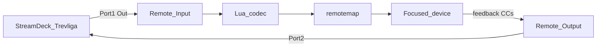

# Reason Remote

## Mandatory first step

Before creating or installing any Remote codec/map:

1. Re-read this skill.
2. Prefer [`reason-streamdeck-remote/install-remote.ps1`](../../../reason-streamdeck-remote/install-remote.ps1).
3. Fully quit and restart **Reason or Reason Recon** after codec/map changes.
4. For the Stream Deck companion profile half, also read [streamdeck-profiles](../streamdeck-profiles/SKILL.md).

## Two different MIDI stacks (do not mix)

| Path | Ports | Feedback | This repo |
| --- | --- | --- | --- |
| **Remote** (Preferences → MIDI → control surfaces) | In Port 1 / Out Port 2 | Yes (change-driven) | `reason-streamdeck-remote/` |
| **External Control Bus** (Sync prefs → Bus A) | `loopMIDI Port` only | No | Reason-Fury profile |

Fury’s CC chart on External Bus is **one-way**. It does **not** use Remote codecs or remotemaps.

## Prefer existing scripts

| Side | Script |
| --- | --- |
| Reason codec + map | `reason-streamdeck-remote/install-remote.ps1` |
| Stream Deck profile | `reason-streamdeck-remote/build-remote-profile.ps1` + `install-streamdeck-profile.ps1` |

`build-remote-profile.ps1` alone does **not** register a manufacturer in Reason.

## Hard invariants

| Rule | Correct | Failure |
| --- | --- | --- |
| Two installs | A: `install-remote.ps1`; B: Stream Deck profile scripts | Manufacturer missing or Deck profile missing |
| Map filename | `{Manufacturer} {Model}.remotemap` e.g. `Community Stream Deck+ Remote.remotemap` | "Remote Mapping file cannot be found"; ports/OK disabled |
| Remotemap delimiters | **Tabs** everywhere (`Scope\tPropellerheads\tCombinator`) | Control surface error / map ignored |
| Install roots | Both `%PROGRAMDATA%\Propellerhead Software\Remote` and `%APPDATA%\Propellerhead Software\Remote` | Codec or map not found after restart |
| Codec set | `.luacodec` + `.lua` + `.png` (about 96×96); manufacturer/model match map | Surface missing or broken |
| Dual ports | Remote In = `loopMIDI Port 1`, Out = `loopMIDI Port 2` | Feedback loop if same port both ways |
| Easy MIDI | Uncheck Port 1 and Port 2 when Remote owns them | Double-handling |
| Restart | Fully quit Reason **or Recon** after install | Stale map; ports greyed until reload |
| Recon | Same ProgramData Remote; error text may say "Reason Recon Remote Mapping" | Looking for a separate Recon-only map format |

This project’s surface:

- **Manufacturer:** `Community`
- **Model:** `Stream Deck+ Remote`
- **Map file:** `Community Stream Deck+ Remote.remotemap`

## Workflows

### Add the surface

1. Run `install-remote.ps1` (copies codec + map to ProgramData and AppData).
2. Fully restart Reason / Recon.
3. Preferences → MIDI → Add manually → Community → Stream Deck+ Remote.
4. Input: `loopMIDI Port 1` · Output: `loopMIDI Port 2`.
5. Uncheck Easy MIDI for Port 1 and Port 2.
6. Install/select Stream Deck profile **Reason - Remote** (see streamdeck-profiles skill).

### Extend mappings

1. Select a device in the rack → **File → Export Device Remote Info**.
2. Add a `Scope\tPropellerheads\t<Device Name>` block (or RE manufacturer/scope from the export).
3. Add `Map\tKnob N\t\t<Remotable Item>` lines (tabs).
4. Re-run `install-remote.ps1` and restart the app.

### Debug order (ports/OK disabled or control surface error)

1. Map filename is exactly `Community Stream Deck+ Remote.remotemap` (not model-only).
2. Remotemap uses tabs (compare to stock `Scope\tPropellerheads\tMaster Keyboard`).
3. Files exist under ProgramData **and** AppData `Remote\Codecs\Lua Codecs\Community` + `Remote\Maps\Community`.
4. Easy MIDI not claiming Port 1/2.
5. Fully restart Reason/Recon.
6. Preferences → Info on control surface error for the report string.
7. Recon ASSERT in `MIDIUtils.cpp` on feedback → knob auto_outputs must use `x="value"` when items have `min=0, max=127` (not `127*value`).

## More detail

See [reference.md](reference.md).
